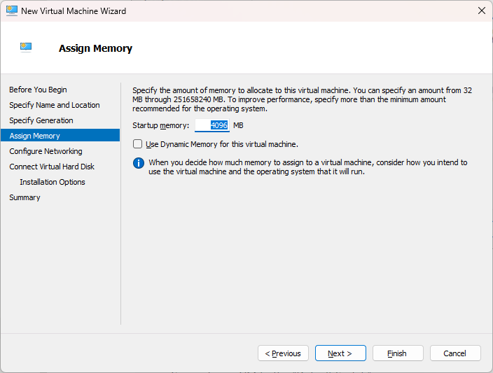

# Setup Linux VM using HyperV
This article describes how to setup a Linux instance inside HyperV

> Reference: https://ubuntu.com/server/docs/how-to-set-up-ubuntu-on-hyper-v

- Download Ubuntu Server image from Ubuntu website: https://ubuntu.com/download/server
- Save .iso image within a known folder, we will use it later
- Open HyperV Manager
    - For this article, we will use your own machine, but it’s just as easy to setup on a remote machine.
- On the left side menu → Click on “New” → “Virtual Machine”
- Setup a name for it

- Memory
    - Setup 4Gb of memory
    - Disable dynamic memory for now

- Networking
    - Connect your VM to the “Default Switch”

- Virtual Disk
    - 50Gb should be enough for our testing

- Installation options
    - Select the Ubuntu Server image

- Finish the setup
- Right click on the VM → “Settings…” → Security tab
- Change “Secure Boot” template from “Microsoft Windows” to “Microsoft UEFI Certificate Authority”

- Apply change.